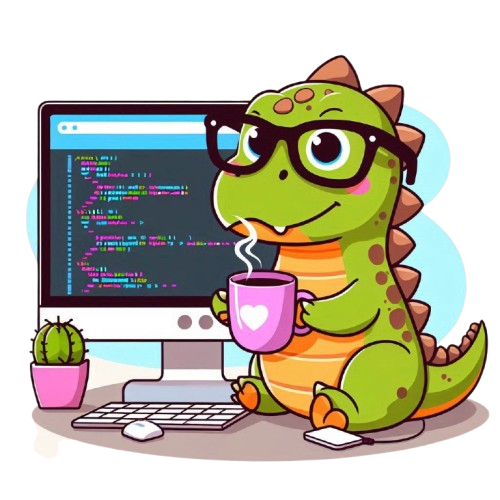

# 💻 TADS TECH 
Este projeto está sendo feito em colaboração com a turma do 2º ANO de TADS do IFPR - Campus Cascavel.

O TADS TECH é um projeto realizado na matéria e Projeto Integrador, criado pela aluna Leticia Mussolin. O objetivo desta tarefa, é apresentar aos colegas a metodologia ágil "Scrum", através de planejamento e desenvolvimento de atividades práticas.
***
Em nossa atividade, simulamos tabalhar na empresa fictícia "TADS TECH". Uma empresa voltada ao desenvolvimento de sites Web. Nossa atividade está organizada com os seguintes esquadrões: 
- Time Product Owner (PO);
- Time Scrum Master (SM);
- Time de Desenvolvimento Web (DEV);
- Time de Garantia de Qualidade (QA).

Onde:

- Time PO: conta com a equipe de planejamento do projeto. O time é responsável por ouvir os clientes, e trazer as informações de forma objetiva a todo o time, através da documentação do projeto.
- Time SM: esta equipe é responsável por acompanhar o desenvolvimento do projeto, cuidar dos prazos e sanar as dúvidas da equipe. Este time conta apenas com um membro, que durante a sprint, torna-se o braço direito do PO.
- Time DEV: é responsável por produzir as alterações e implementações das tarefas repassada pelo time do PO. Este, deve atentar-se a seguir detalhadamente as solicitações das tarefas (tasks).
- TIME QA: deve garantir que o projeto desenvolvido pela equipe DEV, tenha seguido todas as recomendações propostas na tarefa, e que não tenha prejudicado o sistema, ocasionado novos bugs e despadronizações. 
***
Por fim, cada equipe deve desempenhar seu papel. E dependem de seus colegas para que o projeto seja desempenhado adequadamente. 

Estou fazendo um teste de funcionamento para o add e push.
Segundo Teste.
Terceiro teste.
